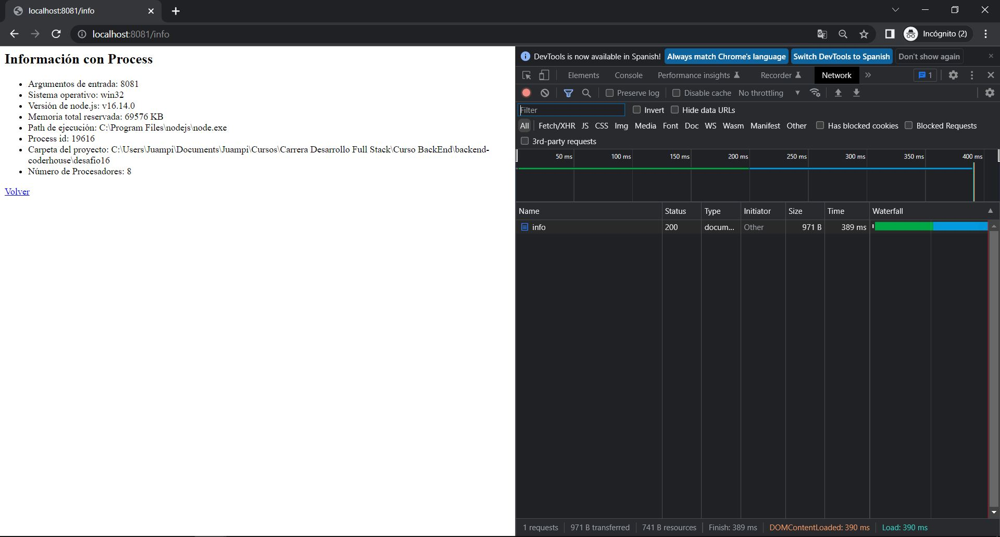
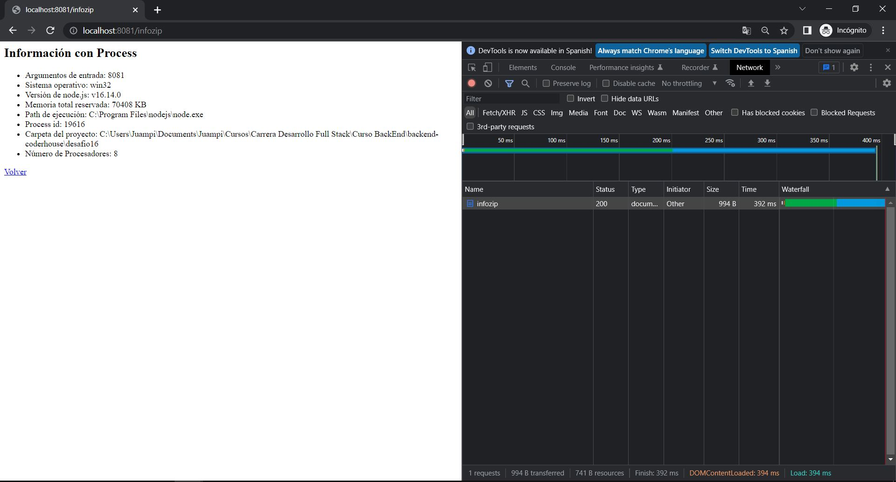
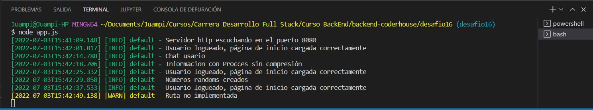
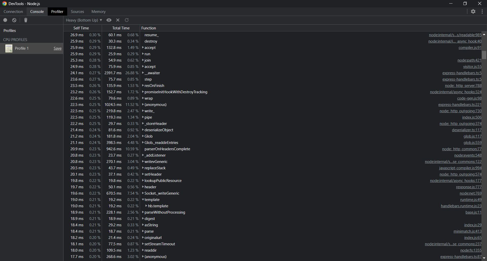
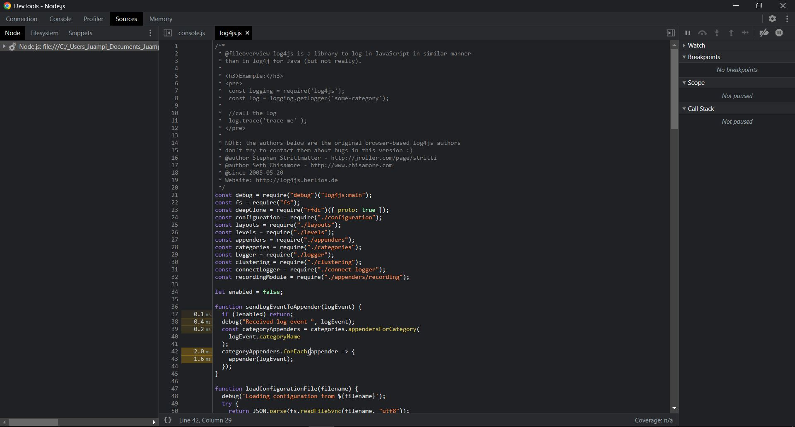
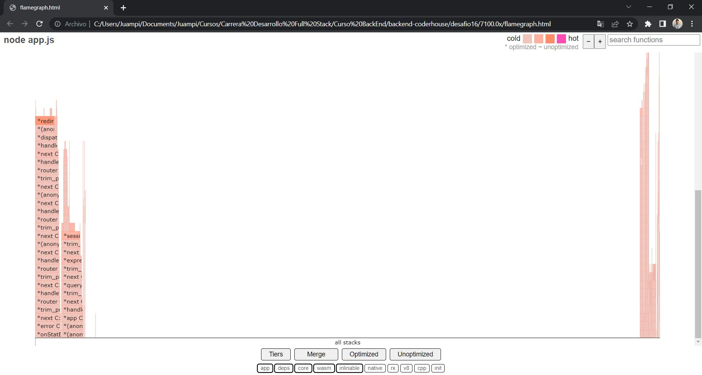

# Desafio 16 - Loggers, gzip y análisis de performance

## Uso

1. Forkeá y cloná el branch desafio16.
2. En la terminal, parado en la raíz del proyecto, corré el siguiente comando para instalar todas las dependencias necesarias.

```
npm i
```

4. Recordá tener instalado de manera global la librería _pm2_.

```
npm i pm2 -g
```

5. Luego en el archivo _commands.md_, que se encuentra en _desafio16/docs_, vas a encontrar los comandos a ejecutar via terminal para correr la app.

## Rutas

- POST (**/login**) → Formulario para loguear usuario. Las sesiones son almacenadas en MongoDB Atlas.
- POST (**/logout**) → Se accede al clickear el botón _logout_, luego de 2 segundos redirige a _login_.
- GET (**/productos**) → Lista todos los productos disponibles.
- POST (**/productos**) → Agrega productos al listado.
- GET (**/productos-test**) → Muestra 5 productos generados al azar con _faker.js_.
- GET (**/chat**) → Muestra un chat desarrolado con _socket.io_, a su vez muestra los datos desnormalizados y es almacenado normalizado en un archivo JSON.
- GET (**/info**) → Muestra información relacionada a la app. A diferencia del desafio anterior, se incluyó el numero de procesadores.
- GET (**/randoms**) → Devuelve números aleatorios en el rango del 1 al 1000 especificada por parámetros de consulta (query). Por ejemplo: `/randoms?cant=500`. Si no se ingresa el parámetro, calcula 1.000 números.

## Compresión gzip

Se hizo la prueba en la ruta `/info` sin compresión y en la ruta `/infozip`, y estos fueron los resultados:

### Sin compresión


### Con compresión


## Logueo

### log4js

El archivo de configuración se encuentra en _utils/logger.js_ y todos los logs generados se pueden ver por consola. Además los logs de nivel error y warning, se los puede ver en los archivos _error.log_ y _warn.log_ dentro de la carpeta _logs_.


## Performance

### Node Profiling (_performance/nodeProfiling/resultNodeProfiling.txt_)

- Se hizo la prueba en la ruta `/info` y estos fueron los resultados:

Emulando 50 conexiones concurrentes con 20 request por cada una → http.request_rate: 414/sec.

### Artillery

Se hizo la prueba en la ruta `/info` y estos fueron los resultados:

- Modo Fork (_performance/artillery/resultFork.txt_)

Emulando 50 conexiones concurrentes con 20 request por cada una → http.request_rate: 173/sec.

- Modo Cluster (_performance/artillery/resultCluster.txt_)

Emulando 50 conexiones concurrentes con 20 request por cada una → http.request_rate: 388/sec.

### Chrome Inspect (_performance/chromeInspect/resultChromeInspect.txt_)

Se hizo la prueba en la ruta `/info` y estos fueron los resultados:

Emulando 50 conexiones concurrentes con 20 request por cada una → http.request_rate: 198/sec.



### Autocannon y 0x (_7100.0x/flamegraph.html_)

Se hizo la prueba en la ruta `/info` y estos fueron los resultados:



Se observan muchos picos y poco tiempo de procesamiento, es decir los procesos son cortos. Al demorar menos cada proceso, se responde más rápido a cada request.


# Autor
Giorgis Alejandro

# Reconocimientos
Equipo CoderHouse

