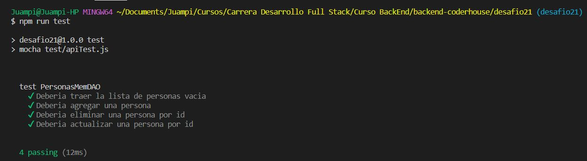

# Desafio 21 - TESTEAMOS NUESTRA API REST

## Consigna
Revisar en forma completa el proyecto entregable que venimos realizando, refactorizando y reformando todo lo necesario para llegar al esquema de servidor API RESTful en capas planteado en esta clase.

Asegurarse de dejar al servidor bien estructurado con su ruteo / controlador, negocio, validaciones, persistencia y configuraciones (preferentemente utilizando en la codificación clases de ECMAScript).

No hace falta realizar un cliente ya que utilizaremos tests para verificar el correcto funcionamiento de las funcionalidades desarrolladas.

- Escribir una suite de test para verificar si las respuestas a la lectura, incorporación, modificación y borrado de productos son las apropiadas. Generar un reporte con los resultados obtenidos de la salida del test.

## Uso

1. Forkeá y cloná el branch _desafio21_.
2. En la terminal, parado en la raíz del proyecto, corré el siguiente comando para instalar todas las dependencias necesarias.

```
npm i
```

3. Parado en la raíz del proyecto, corré el siguiente comando para testear la API.

```
npm run test
```



4. Parado en la raíz del proyecto, corré el siguiente comando para ejecutar la API.

```
npm start
```

## Archivo _.env_

En este archivo podés cambiar el tipo de persistencia _MEM_, _FILE_, _MONGO_, por defecto está seteado en _MEM_.

## Rutas para probar con Postman

- GET (**/personas/:id**) → Obtener una persona por id.
- POST (**/personas**) → Agregar una persona.
- PUT (**/personas/:id**) → Actualizar una persona por id.
- DELETE (**/personas/:id**) → Borrar una persona por id.

# Autor

Giorgis Alejandro

# Reconocimientos

Equipo CoderHouse