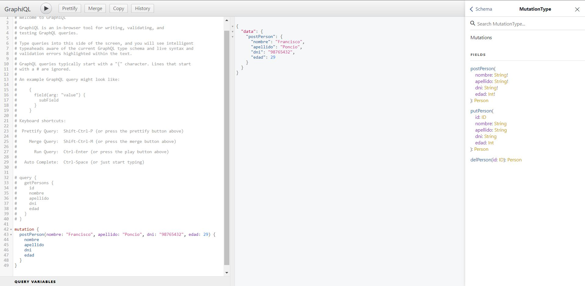
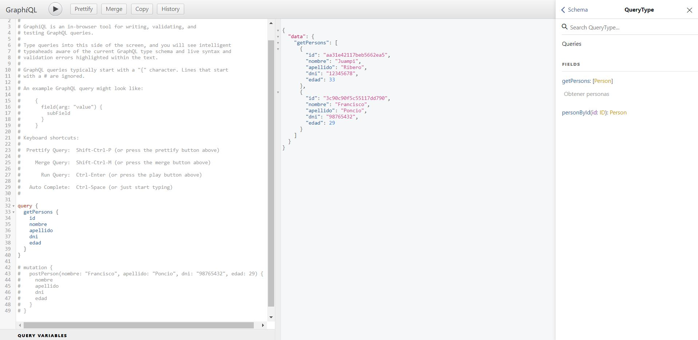
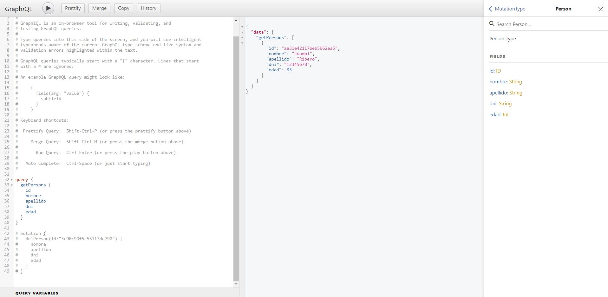

# Desafio 22 - REFORMAR PARA USAR GRAPHQL

## Consigna
- En base al último proyecto entregable de servidor API RESTful, reformar la capa de routeo y el controlador para que los requests puedan ser realizados a través del lenguaje de query GraphQL. 
- Si tuviésemos un frontend, reformarlo para soportar GraphQL y poder dialogar apropiadamente con el backend y así realizar las distintas operaciones de pedir, guardar, actualizar y borrar recursos.
- Utilizar GraphiQL para realizar la prueba funcional de los querys y las mutaciones.


## Uso

1. Forkeá y cloná el branch _desafio22_.
2. En la terminal, parado en la raíz del proyecto, corré el siguiente comando para instalar todas las dependencias necesarias.

```
npm i
```

3. Parado en la raíz del proyecto, corré el siguiente comando para ejecutar la API.

```
npm start
```

4. Luego ingresá a http://localhost:8080/graphql y comenzá a ejecutar las _queries(getPersons, personById)_ y _mutations (postPerson, putPerson, delPerson)_.

## Capturas de Pantalla de Ejecución

Ejecuto la _mutation postPerson_ para agregar 2 personas.



Ejecuto la _query getPersons_ para mostrar todas las personas.



Luego de ejecutar la _mutation delPerson_, ejecuto nuevamente la _query getPersons_ para mostrar todas las personas, en este caso solo queda 1 ya que la otra fue eliminada.




## Autor

Giorgis Alejandro

## Reconocimiento

CoderHouse