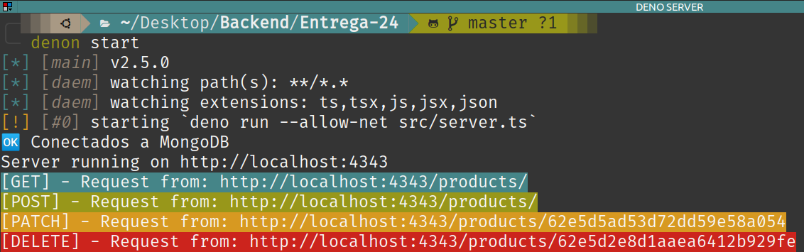

# Desafío 24 - Servidor en DENO

## Consigna

1- Crear un servidor que utilice el módulo http servest y genere la vista con Reacr render.

2- Configurar denon para que, ante un cambio de codigo, el servidor se reinicie automaticamente.

## Servidor en Deno

Servidor simple en Deno con persistencia de datos en MongoDB.

Para iniciar scripts.json (cuando estes creando un nuevo proyecto):
#### `denon --init`

Para correr el script que inicia el server, en **Entrega-24/**:
#### `denon start`

De acuerdo a cada tipo de petición, se muestra en terminal un color diferente.

## Autor

Giorgis Alejandro

## Agradecimientos

Coder House 